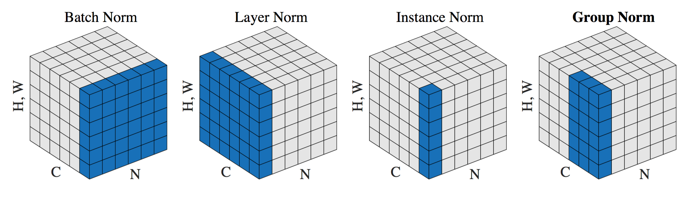
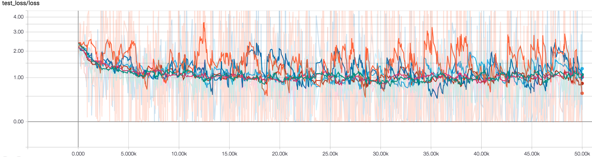
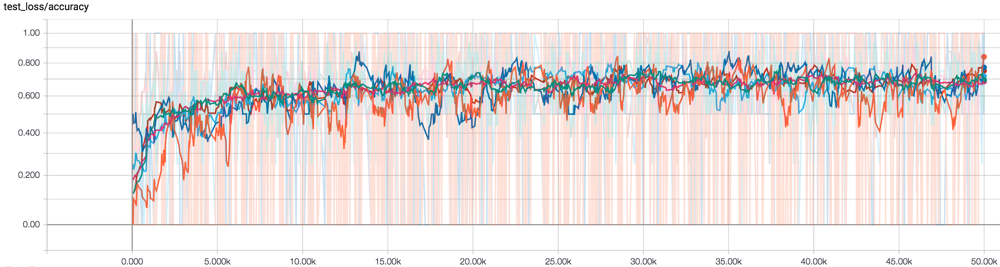
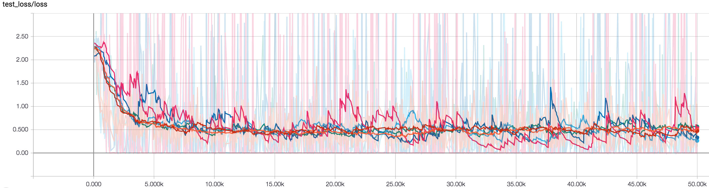
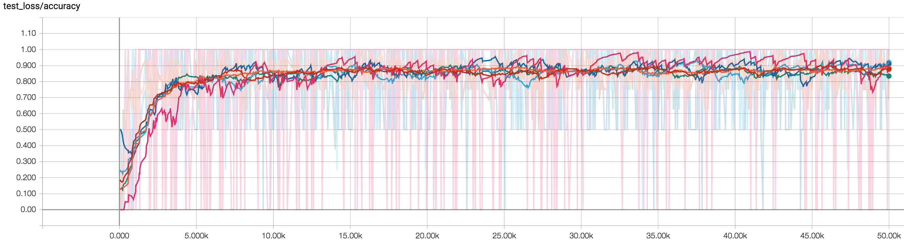
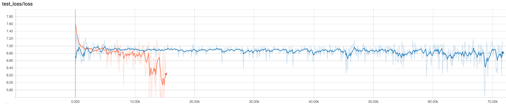

# Group Normalization

## Descriptions
This project includes a Tensorflow implementation of Group Normalizations proposed in the paper [Group Normalization](https://arxiv.org/abs/1803.08494) by Wu et al. [Batch Normalization](https://arxiv.org/abs/1502.03167) (BN) has been widely employed in the trainings of deep neural networks to alleviate the internal covariate shift [1].Specifically, BN aims to transform the inputs of each layer in such a way that they have a mean output activation of zero and standard deviation of one. While BN demonstrates it effectiveness in a variety of fields including computer vision, natural language processing, speech processing, robotics, etc., BN's performance substantially decrease when the training batch size become smaller, which limits the gain of utilizing BN in a task requiring small batches constrained by memory consumption. 

Motivated by this phenomenon, the Group Normalization (GN) technique is proposed. Instead of normalizing along the batch dimension, GN divides the channels into groups and computes within each group the mean and variance. Therefore, GN’s computation is independent of batch sizes, and so does its accuracy. The experiment section of the paper demonstrates the effectiveness of GN in a wide range of visual tasks, which include image classification (ImageNet), object detection and segmentation (COCO), and video classification (Kinect). This repository is simply a toy repository for those who want to quickly test GN and compare it against BN.



The illustration from the original GN paper. Each cube represent a 4D tensor of feature maps. Note that the spatial dimension are combined as a single dimension for visualization. N denotes the batch axis, C denotes the channel axis, and H, W denote the spatial axes. The values in blue are normalized by the same mean and variance, computed by aggregating the values of these pixels.

Based on the implementation of this repository, GN is around 20% slower than BN on datasets such as CIFAR-10 and SVHN, which is probably because of the extra reshape and transpose operations. However, when the network goes deeper and the number of channels increase, GN gets even slower due to a larger group size. The model uses GN is around 4 times slower than the one uses BN when being trained ImageNet. This is not reported in the original GN paper.

\*This code is still being developed and subject to change.

## Prerequisites

- Python 2.7 or Python 3.3+
- [Tensorflow 1.3.0](https://github.com/tensorflow/tensorflow/tree/r1.0)
- [SciPy](http://www.scipy.org/install.html)
- [NumPy](http://www.numpy.org/)

## Usage

### Datasets
Train models on MNIST, Fashion MNIST, SVHN, CIFAR-10 datasets:
- Download datasets with:
```bash
$ python download.py --dataset MNIST Fashion SVHN CIFAR10
```
Train models on [Tiny ImageNet](https://tiny-imagenet.herokuapp.com/)
- Download the dataset from the [webpage](https://tiny-imagenet.herokuapp.com/).
- Move the downloaded file (named ) to `datasets/tiny_imagenet` and unzip it.

Train models on [ImageNet](http://image-net.org/download-images)
- The ImageNet dataset is located in the Downloads section of the [website](http://image-net.org/download-images). Please specify the path to the downloaded dataset by changing the variable `__IMAGENET_IMG_PATH__` in `datasets/ImageNet.py`. Also, please provide a list of file names for trainings in the directory `__IMAGENET_LIST_PATH__` with the file name `train_list.txt`. By default, the `train_list.txt` includes all the training images in ImageNet dataset.

### Train models with downloaded datasets:
Specify the type of normalization you want to use by `--norm_type batch` or `--norm_type group` 
and specify the batch size with `--batch_size BATCH_SIZE`.
```bash
$ python trainer.py --dataset MNIST --learning_rate 1e-3
$ python trainer.py --dataset Fashion --prefix test
$ python trainer.py --dataset SVHN --batch_size 128
$ python trainer.py --dataset CIFAR10 
```

### Train and test your own datasets:

* Create a directory
```bash
$ mkdir datasets/YOUR_DATASET
```

* Store your data as an h5py file datasets/YOUR_DATASET/data.hy and each data point contains
    * 'image': has shape [h, w, c], where c is the number of channels (grayscale images: 1, color images: 3)
    * 'label': represented as an one-hot vector
* Maintain a list datasets/YOUR_DATASET/id.txt listing ids of all data points
* Modify trainer.py including args, data_info, etc.
* Finally, train and test models:
```bash
$ python trainer.py --dataset YOUR_DATASET
$ python evaler.py --dataset YOUR_DATASET
```

## Results

### CIFAR-10

| Color    | Batch Size |
| :------- | ---------- |
| Orange   | 1          |
| Blue     | 2          |
| Sky blue | 4          |
| Red      | 8          |
| Green    | 16         |
| Pink     | 32         |

- Loss

  

- Accuracy



### SVHN

| Color    | Batch Size |
| :------- | ---------- |
| Pink     | 1          |
| Blue     | 2          |
| Sky blue | 4          |
| Green    | 8          |
| Red      | 16         |
| Orange   | 32         |

- Loss

  

- Accuracy



### ImageNet

The trainings are ongoing...

| Color  | Norm Type           |
| :----- | ------------------- |
| Orange | Group Normalization |
| Blue   | Batch Normalization |



### Conclusion
The Group Normalization divides the channels into groups and computes within each group the mean and variance, and therefore its performance independent of training batch sizes, which is verified with this implementation. However, the performance of Batch Normalization does not vary a lot with different batch sizes on smaller image datasets including CIFAR-10, SVHN, etc. The ImageNet experiments are ongoing and the results will be updated later.

## Related works
* [Group Normalization](https://arxiv.org/abs/1803.08494)
* [Batch Normalization: Accelerating Deep Network Training by Reducing Internal Covariate Shift](https://arxiv.org/abs/1502.03167)

## Author

Shao-Hua Sun / [@shaohua0116](https://shaohua0116.github.io/) @ [Joseph Lim's research lab](https://github.com/gitlimlab) @ USC
